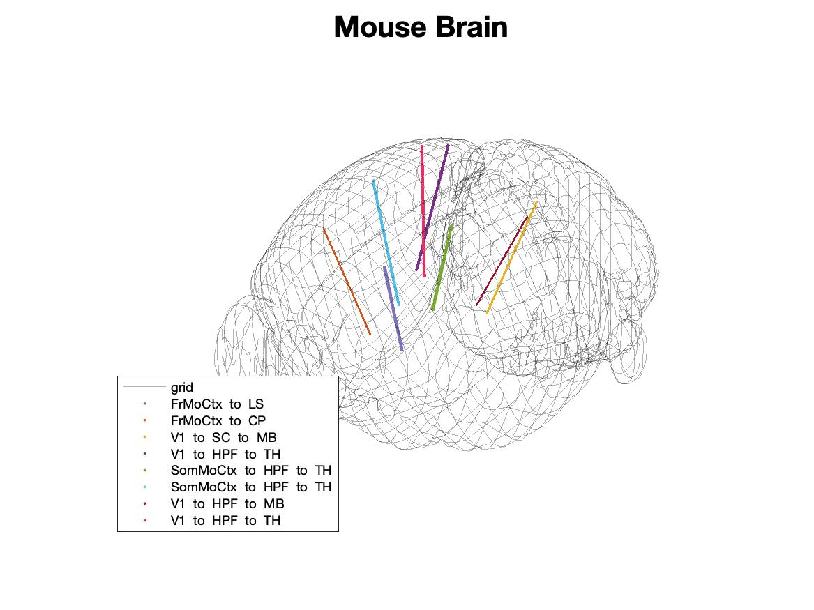

<style type="text/css">
body{ /* Normal  */
      font-size: 14px;
  }
</style>

```{r setup, include=FALSE}
knitr::opts_chunk$set(echo=FALSE,message=FALSE,warning=FALSE)
```


Team ID: 5

Name (tasks): Oscar Alvardo

Name (tasks): Karshima Johnson (Spike Trains and Spike Train Analysis, Statistics Regarding Neurons, Population and Study Design, Correlation Matrices for entire time frame, Visuals of Krebs, Data Transformation)

Name (tasks): Christina Thai (Introduction, Background, Summary of Data, Visual of Probe Locations in Brain, Time Series Visual of Average Number of Neurons/Region, Kendall Tau's correlation)


***

# Introduction

This document is the final report for the Spring 2019 course STA 141A at University of California, Davis. It seeks to examine whether activity in one region affects the activity in another region. 

To reduce the variability of cortical responses to sensory stimuli, analyzing the neural spikes in multiple brain regions during spontaneous activity will yield more accurate, less noisy, results. 

Using the data gathered from contributors Nick Steinmetz, Marius Pachitariu, Carsen Stringer, Matteo Carandini, and Kenneth Harris' experiment, we seek to analyze the areas of the brain that are used in conjunction, regardless of stimuli. The original experiment investigates fluctuations in arousal levels indicated by running, pupil area, and whisking. Our variable of interest is the cortical responses as these behaviors are ongoing. 


## Background

```{r, message = FALSE, include=FALSE}
library("R.matlab") # Install 'R.matlab' if this is the first time you call it.
# Below VV Will vary depending on the local pathway for each computer
ephysroot = '/Users/christinathai/Desktop/R_programming/STA_141A/Project/'; #path of the data set 
mstr = 'Krebs'; # mouse names
### Load saved data:
exp_data<- readMat(paste(ephysroot,mstr,'_reduced.mat',sep=''));
# Check out data structure
str(exp_data)
```
```{r, message = FALSE, include=FALSE}

library(ggcorrplot)
library(corrplot)
library(knitr)
library(matrixStats)
library(qlcMatrix)
library(dygraphs)
library(dplyr)
library(plotly)
```

In this project, we analyze the reduced data set `Reduced_Krebs.mat` containing Neuropixel recordings of a mouse named Krebs during spontaneous activity. The full data set can be found at this [webpage](https://janelia.figshare.com/articles/Eight-probe_Neuropixels_recordings_during_spontaneous_behaviors/7739750).

The data used has already been preprocessed using a Matlab script, which can be found in the code Appendix of the report. 


# Summary of Data

This report focuses on data collected from an experiment done with a mouse named Krebs. The neuron activation recorded from stimuli from whisking (measured by summed videographic motion energy within the whisker region).

This data set contains [spike trains](https://en.wikipedia.org/wiki/Neural_coding) of neurons in nine regions in the mouse brain.

These spike trains for the duration of recording period are visualized as follows. Each point represents a neuron firing within its brain region at the given time period. A spike corresponds to all of the neural firings at a time frame. Each time frame index corresponds to 30ms. In total, we have 39053 time frames, corresponding to 1171.59s of recorded data for Krebs. Sequences of spikes, form a spike train such as follows. 

```{r, echo = FALSE}
brain_regions= ls(exp_data)[-c(1:3)]; 
n_time= dim(exp_data$faceSVD)[2];
n_sv = dim(exp_data$faceSVD)[1];

plot_list = list()
for(i_region in 1:9) {
  time_range = c(0, n_time); # indices of time frame
  
  ### Extract the spike train for this region
  spikes_this_region = exp_data[[brain_regions[i_region]]]
  
  ### Visualize the spike train 
  n_neurons = dim(spikes_this_region)[1]; 
  p = plot(x=0,y=0,pch=16,col="white",type="l",lwd=3,ylim=c(0,n_neurons),
           xlim=time_range,cex.lab=1,cex.main=1,ylab='Neuron',xlab='Time frame',
           main=paste0("Spike Train Region ", i_region, " Time ", time_range[1], 
                       " to ", time_range[2]))
  #yaxt='n',xaxt='n',
  
  for(i_neuron in 1:n_neurons){
    spk_times =which(spikes_this_region[i_neuron,time_range[1]:time_range[2]]>0);
    if (length(spk_times)>0){
      points(y=rep(i_neuron,length(spk_times)),x=spk_times+time_range[1]-1,col="#000000",pch='.',cex=2)
    }
  }
  
  plot_list[[i_region]] = p
}
```

Within the spike tains we notice that certain brain regions (e.g. Region 4) have missing spikes, which we believe could be a result of technological data or error in recording with the sensory probes.  


The following represent elements of behavior data:
`avgframe` Average Frame of Recording <br />
`faceSVD` Singular Value Decompositon of Compressed Image of Face <br />
`motionMask` Corresponding Masks to Singular Values <brv/>

The data set being referenced `Reduced_Krebs.mat` contains the first 50 singular values and their masks. These are used to reproduce an image based on the average of the frames within the data set using infrared camera. 


The following columns represent the nine regions for Krebs in the mouse brain:

`stall.CP` Caudate Putamen <br />
`stall.FrMoCtx` Frontal Motor Cortex<br />
`stall.HPF` Hippocampal Formation<br />
`stall.LS` Lateral Septum<br />
`stall.MB` Midbrain<br />
`stall.SC` Superior Colliculus<br />
`stall.SomMoCtxx` Somatomotor Cortex<br />
`stall.TH` Thalamus<br />
`stall.V1` Primary Visual Cortex <br />

The data set contains spike trains of neurons in nine regions of the mouse brain. Each corresponding column represents a specific region of the brain; for example, the vector `stall.CP` relates to the activity and activation of neurons located in the Caudate Putamen.

A more in depth explanation on the structure of our data is that it is a binary matrix with values of 1 denoting an existance of neural activity and 0 being that there is no neural activity at the specific time frame. Each row represents a neuron within the region. 

## Visual of Brain Regions
```{r pressure, echo=FALSE, fig.cap="Probe Locations of Mouse Brain", out.width = '100%'}

```


The figure above is the reconstructed probe locations of recordings in Krebs. The poles are generated using the borders of the brain regions and map depth of the region in microns relative to position of the principal axes of the body (AP/DV/LR). 

**Note:** AP refers the antero-posterior, DV refers to the dorso-ventral, and LR refers to the left-right axis formation.


```{r, echo = FALSE, eval = TRUE, message = FALSE}
brain_regions= ls(exp_data)[-c(1:3)]; 
n_time= dim(exp_data$faceSVD)[2];
n_sv = dim(exp_data$faceSVD)[1];
```

# Statistical questions of interest

We wish to examine which brain regions are being are activated(?) relatively simultaneously. In other words, we seek to examine if brain activity in the Thalamus can also imply activity in the Primary Visual Cortex.

Additionally, we want to examine neural activity throughout the entire time period and locate where there may be significant changes in neural activity.


# Analysis Plan

## Population and study design

The initial study monitored large populations of neurons in awake head-fixed mice. These mice were unengaged from behavioral task and then their spontaneously performed behaviors (i.e. whisking, sniffing, and other facial movements) were monitored videographically. The study recorded simultaneous neurological data of six mice over nine sessions and worked to identify the relationship between these behaviors and their neural activity.  

Further, the studies were testing in various settings such as with and without darkness and recordings in darkness or with a gray screen. They observed no differences between these recordings, thus we take it to imply that Krebs' sample data is representative of the mouse's overall behavior in this experiment[.](https://www.biorxiv.org/content/biorxiv/early/2018/04/22/306019.full.pdf) 

In addition, we acknowledge that mouse models for genetic research prove to be excellent tools for insight into immune, endocrine, cardiovascular, skeletal, and in particular, nervous systems shared by mammals[.](https://www.genome.gov/10005834/background-on-mouse-as-a-model-organism) Thus conclusions obtained through the study may be a gateway to understanding the human brain.  


## Kendall Tau's Correlation

We choose to examine the pairwise correlations with Kendall's method with ranks since this method does not need any assumptions on the distribution. This non-parametric correlation method measures the number of discordant and concordant pairs.
Assume there are pairs $(X_i, Y_i)$ and $(X_j,Y_j)$ where $i < j$. If $X_i < X_j$ and $Y_i < Y_j$, then $(X_i - X_j) \times (Y_i - Y_j) > 0$ and $(X_i, Y_i)$ and $(X_j,Y_j)$. Thus $(X_i, Y_i)$  $(X_j,Y_j)$ is a concordant pair and an increase in X implies an increase in Y.
Similar logic is applied to the definition of discordant pairs, which can be seen in the mathematical definition: $(X_i - X_j) \times (Y_i - Y_j) < 0$. Tied pairs mean $(X_i - X_j) \times (Y_i - Y_j)  = 0$
Kendall's $\tau = \frac{C - D}{n(n-1)/2)}$, where C is the number of concordant pairs and D represents discordant pairs.
If most pairs are concordant, then there is a postive linear relationship. Similarly, if most pairs are discordinant, then the data suggests a negative linear relationship. If there are an equal number of discordant and concordant pairs, this suggests no linear relationship, i.g. X and Y are independent. 


# Results

## Descriptive Anaysis

Within our data, we observe the frequencies of neural firings from each brain region. 

```{r, echo = FALSE, message = FALSE}
t0 <- 0
tn <- n_time

hists <- list()
neuron_count <- vector()
neuron_avg_df_c <- data.frame()
neuron_pt_mean <- vector()
for(i_region in 1:9){
  ### initialize time frame to work with
  time_frame <- c(t0,tn)
  
  ### Extract the spike train for this region
  spikes_this_region = exp_data[[brain_regions[i_region]]]
  
  ### number of neurons in i_region stored in vector
  #neuron_count[i_region] <- dim(spikes_this_region)[1]
  neuron_count <- dim(spikes_this_region)[1]
  
  ### neurons at given time frame 
  neuron_time <- colSums(spikes_this_region) # sums binary ints per time_frame index
  
  ### number of neurons at given time given total neuron count
  neurons_pt <- as.vector(neuron_time/neuron_count) 
  
  neuron_pt_mean[i_region] <- mean(neurons_pt)
  
  # neuron_hist <- hist(neurons_pt)
  # hists[[i_region]] <- neuron_hist ## frequency of neurons at time / total neurons
  
  ### stores neuron time / total neurons for i_regions as data frame
  neuron_avg_df_c <- rbind(neuron_avg_df_c,neurons_pt)
}

neuron.avg.mat <- t(neuron_avg_df_c)
neuron.avg.df <- as.data.frame(neuron.avg.mat)
names(neuron.avg.df) <- c("CP","FrMoCtx","HPF",
                            "LS", "MB", "SC", "SoMoCtxx","TH","V1")


neurons.each.region <- data.frame()
for (i in 1:9){
  neurons.region.i <- dim(exp_data[[brain_regions[i]]])[1]
  neurons.each.region <- rbind(neurons.each.region, neurons.region.i)
}
neurons.each.region <- as.data.frame(t(neurons.each.region))

names(neurons.each.region) = c("CP","FrMoCtx","HPF",
                                   "LS", "MB", "SC", "SoMoCtxx","TH","V1")
rownames(neurons.each.region) <- c("Neurons per Region")

knitr::kable(neurons.each.region, digits = 6,caption = "Neurons Per Brain Region")
```

In order to compare neural activity between brain regions (e.g. comparing the Primary Visual Cortex to the Midbrain), we consider the proportion of neurons firing at a given time frame (equivalent to 30ms) to the total number of neurons in the brain region. This will also be referred to as the amount of neural activity in a region at a given time or neural firing rate.  

The frequencies of these firing rates can be observed as follows:

```{r, echo = FALSE}
library(plotly)
p <- plot_ly(alpha = 0.5, width = 0.2, colors = "Spectral") %>%
  add_histogram(x = neuron.avg.df$CP, name = "CP") %>%
  add_histogram(x = neuron.avg.df$FrMoCtx, name = "FrMoCtx") %>%
  add_histogram(x = neuron.avg.df$HPF, name = "HPF") %>%
  add_histogram(x = neuron.avg.df$LS, name = "LS") %>%
  add_histogram(x = neuron.avg.df$MB, name = "MB") %>%
  add_histogram(x = neuron.avg.df$SC, name = "SC") %>%
  add_histogram(x = neuron.avg.df$SoMoCtxx, name = "SoMoCtxx") %>%
  add_histogram(x = neuron.avg.df$TH, name = "TH") %>%
  add_histogram(x = neuron.avg.df$V1, name = "V1") %>%
  layout(barmode = "overlay")
p
```

To highlight features of each brain region, we observe the maximum, minimum, average, and variance of proportion of fired neurons compared to total neurons per region. We do not include zero as a minimum for neural activity due to the fact that it represents a lack of activity, not within our interests.


```{r, echo = FALSE}
neuron_avg_df_c.mat <- as.matrix(neuron_avg_df_c)
library(qlcMatrix)
maxs <- as.vector(rowMax(neuron_avg_df_c.mat)) # maxs of firing rate 
mins <- as.vector(rowMin(neuron_avg_df_c.mat, ignore.zero = TRUE)) # minimums of firing rate per region exclusing zero
# avgs in neuron_pt_mean 
neuron_pt_mean <- as.vector(neuron_pt_mean) # overall avg neuron firing rate per region
library(matrixStats)
vars <- as.vector(rowVars(neuron_avg_df_c.mat))  # variance of 

require(Matrix)

summary_stats <- as.data.frame(rbind(maxs, mins, neuron_pt_mean, vars))
names(summary_stats) <- c("CP","FrMoCtx","HPF",
                          "LS", "MB", "SC", "SoMoCtxx","TH","V1") # labels according to brain region
rownames(summary_stats) <- c("Maximum Firing Rate", "Minimum Firing Rate", "Average Firing Rate", "Variance of Firing Rate")
library(knitr)
knitr::kable(summary_stats, digits = 6,caption = "Statistics Regarding Proportion of Firing Neurons")
```

It is notable that there are recorded neuron firing rates greater than one. This can be attributed to the fact that one time frame is equivalent to 30ms. It has been [recorded](https://www.ncbi.nlm.nih.gov/pmc/articles/PMC5611364/) that mice can have neurons fire multiple times in 30 ms, therefore it is logical to observe that the proportion of fired neurons in one time frame is larger than the total number of neurons within the region.

We note that the Midbrain has the highest maximum and average firing rate. This implies that the Midbrain has the highest amount of neural activity throughout the entire recording. The Superior Colliculus has the largest minimum neural activity and variance. 

In contrast, we observe that the Caudate Putamen yields the smallest maximum, average, and variance of neural activity and the Primary Visual Cortex has the lowest minimum neural activity.  


##Interactive Plot of Brain Region Activity over Entire Time Period


```{r, echo = FALSE, warning = FALSE, message = FALSE}
#ct variable storing
avg_neuron_list <- vector('list',9)
var_neurons_list <- vector('list', 9)

for (i in 1:9) {
#Calculating the column sums 
spiketrain = exp_data[[brain_regions[i]]];
n_time = dim(spiketrain)[2]
n_neurons = dim(spiketrain)[1]
#Calculating the average number of neurons for each time frame
neurons_fired = colSums(spiketrain)
neurons.avg <- as.vector(neurons_fired/n_neurons)
neurons.var <- var(neurons.avg)
var_neurons_list[[i]] <- neurons.var
avg_neuron_list[[i]] <-neurons.avg

}
```


Recall that the brain regions are:
`stall.CP` Caudate Putamen <br />
`stall.FrMoCtx` Frontal Motor Cortex<br />
`stall.HPF` Hippocampal Formation<br />
`stall.LS` Lateral Septum<br />
`stall.MB` Midbrain<br />
`stall.SC` Superior Colliculus<br />
`stall.SomMoCtxx` Somatomotor Cortex<br />
`stall.TH` Thalamus<br />
`stall.V1` Primary Visual Cortex <br />

The following interactive plot merges and overlaps the plots of the spike trains of each brain region overlapping across the entire recording period. 


```{r}
#Original spike train data

spike_data_frame = data.frame(time = (1:n_time), CP = avg_neuron_list[[1]], FrMoCtx = avg_neuron_list[[2]], HPF = avg_neuron_list[[3]], LS = avg_neuron_list[[4]], MB = avg_neuron_list[[5]], SC = avg_neuron_list[[6]], SoMoCtxx = avg_neuron_list[[7]], TH = avg_neuron_list[[8]], V1 =  avg_neuron_list[[9]])


# plot of entire frame 
dygraph(spike_data_frame) %>%
  dyOptions(labelsUTC = TRUE, fillGraph=TRUE, fillAlpha=0.1, drawGrid = FALSE, colors=c("#a987b7", "#59bad8", "#D8AE5A","#9b2b2b", "#8fb787", "#096010", "#0c62b7", "#f4b7f1", "#ff0008")) %>%
  dyRangeSelector() %>%
  dyCrosshair(direction = "vertical") %>%
  dyHighlight(highlightCircleSize = 8, highlightSeriesBackgroundAlpha = 0.2, hideOnMouseOut = FALSE)  %>%
  dyRoller(rollPeriod = 300)
```
Viewing them as overlapping spikes allows us to see which regions, if any, with similar "spikes" or pattern. We can analyze the spikes using with: <br />
1.  Proportion of neurons in the area have a similar density of neurons firing.
<br />
2. Time periods with is a similar spike trend/pattern in the proportion of neurons firing. <br />

## Reducing Variability in Each Region

Since plotting each proportion of neurons firing at each millisecond is extremely volatile, we proposed to analyze the average proportion of neurons firing at a new interval 1 through 1302 where each "time" is considered a time window of the original 30 time frame units. 
```{r}
#Initialize lists for average and variance of spikes
avg.spikes <- vector('list', 9)
var.spikes <- vector('list', 9)
#definition of calculating the variance of each column
ColVar <- function(x, ...) {
  colSums((x - rowMeans(x, ...))^2, ...)/(dim(x)[2] - 1)
}
for (i in 1:9) {
  avg.spikes[[i]] <- colMeans(matrix(spike_data_frame[[i+1]],30))
  var.spikes[[i]] <- ColVar(matrix(spike_data_frame[[i+1]],30))
}
avg.spikes.data = data.frame(time = (1:length(avg.spikes[[1]])), CP = avg.spikes[[1]], FrMoCtx = avg.spikes[[2]], HPF = avg.spikes[[3]], LS = avg.spikes[[4]], MB = avg.spikes[[5]], SC = avg.spikes[[6]], SoMoCtxx = avg.spikes[[7]], TH = avg.spikes[[8]], V1 =  avg.spikes[[9]])

##Plot of compressed time frames 
dygraph(avg.spikes.data) %>%
  dyOptions(labelsUTC = TRUE, fillGraph=TRUE, fillAlpha=0.1, drawGrid = FALSE, colors=c("#a987b7", "#59bad8", "#D8AE5A","#9b2b2b", "#8fb787", "#096010", "#0c62b7", "#f4b7f1", "#ff0008")) %>%
  dyRangeSelector() %>%
  dyCrosshair(direction = "vertical") %>%
  dyHighlight(highlightCircleSize = 8, highlightSeriesBackgroundAlpha = 0.2, hideOnMouseOut = FALSE)  %>%
  dyRoller(rollPeriod = 300)
```
As expected, we found that the basic trends of the previous (and volatile) plot remains the same. Thus, we can identify any time periods where there are any significant changes in brain activity (stationary or otherwise). See section *Patterns of Brain Region Activity over Entire Time Period* for more details.


```{r}
#Data frame for variance of spikes post compression
var.spikes.data = data.frame(time = (1:length(var.spikes[[1]])), CP = var.spikes[[1]], FrMoCtx = var.spikes[[2]], HPF = var.spikes[[3]], LS =var.spikes[[4]], MB = var.spikes[[5]], SC = var.spikes[[6]], SoMoCtyxx = var.spikes[[7]], TH = var.spikes[[8]], V1 =  var.spikes[[9]])

#plot of variance after compression
dygraph(var.spikes.data) %>%
  dyOptions(labelsUTC = TRUE, fillGraph=TRUE, fillAlpha=0.1, drawGrid = FALSE, colors=c("#a987b7", "#59bad8", "#D8AE5A","#9b2b2b", "#8fb787", "#096010", "#0c62b7", "#f4b7f1", "#ff0008")) %>%
  dyRangeSelector() %>%
  dyCrosshair(direction = "vertical") %>%
  dyHighlight(highlightCircleSize = 8, highlightSeriesBackgroundAlpha = 0.2, hideOnMouseOut = FALSE)  %>%
  dyRoller(rollPeriod = 300)
```
The above plot shows the variance of each 30ms time window for each brain region. Although there seems to be slight spikes in variance, noting the magnitude of the variances shows how insignificant the variability 30 time frames in our new compressed data. 

###Patterns of Brain Region Activity over Entire Time Period
Below is a table of the time periods where the spike train pattern appears to be relatively stationary along with any time periods where there seems to be a significant change in brain region activity. Note that the unit of measurememt is the original time frame unit (before compression). <br />
Stationary | Spike
------------- | -------------
1 - 10,000 | 10,001 - 12,000
12,001 - 19,500 | 20,000 - 29,000
end |  xxx


## Correlation Analysis
To assess for correlation, we use the compressed data with the new unit of time as 1 - 1302 since the volality of the original data set with the time frame was very sensitive and overall noisy.


```{r}
#Time frame of interest
time_frame <- c(1:length(avg.spikes[[1]]))

spikes <- vector('list',9)
for (i in 1:9) {
  spikes[[i]] <- avg.spikes.data[[i]][time_frame]
}


spikes.cor.data = data.frame(CP = spikes[[1]], FrMoCtx = spikes[[2]], HPF = spikes[[3]], LS = spikes[[4]], MB = spikes[[5]], SC = spikes[[6]], SoMoCtxx = spikes[[7]], TH = spikes[[8]], V1 =  spikes[[9]])
```


```{r}
#Computing Kendall's correlation matrix
spikes.cor.kendall <- cor(spikes.cor.data, method = "kendall")
#Computing Pearson's correlation
spikes.cor.pearson <- cor(spikes.cor.data)
```

## Pearson's Correlation
Initially, we chose Pearson's correlation to analyze the relationships between brain regions. 
```{r}
#Plot Pearson Correlation Matrix
corrplot(spikes.cor.pearson, method = "number", type = "lower")
```
<br />
Here, Pearson's correlation is relatively high, which may be due to the fact that the distribution is skewed from the spike around the 20,000 - 30,000 time frame. 

## Kendall's Correlation Matrix
We choose to examine correlation using the Kendall method because it does not require the assumption of a linear relationship, which may skew our values of correlation. 
Another reason why we chose to use Kendall Tau's method for correlation because the ranking of data points mitigates the effects of outliers (the significant pattern difference). 


```{r}
#Plot Kendall Tau Correlation Matrix
corrplot(spikes.cor.kendall, method="number", type = "lower")
```
Kendall's correlation is much smaller value, which we believe is due to the mitigation of outliers, hence a more accurate correlation coefficient. 

It is important to note that the most highly correlated brain regions are the Somamotor Cortex and the Midbrain. This relationship is seen both in Pearson's and Kendall's correlation methods. Additionally, Kendall's method helps mute the potential skews in other brain regions, e.g. Somatomotor Cortex (SoMoCt) and the Superior Colliculus (SC). These correlated relationships imply that brain activity in these regions have a somewhat working relationship and their neural functions may overlap. These results can be supported and/or supplemented with neurobiology. 

# Sensitivity Analysis 

We consider the pairwise correlation between all brain regions for the entire recording period of 39053 time frames (1171.59s). Computing the correlation for the entirety of the recording period becomes increasingly taxing computationally when using the preferred Kendall Tau method. For this reason, we consider Pearson's method to give an idea of the strongest pairwise correlations for the entire recording period which are demonstrated as follows. 

```{r, echo = FALSE, message = FALSE}
corr.prop.neurons <- cor(neuron.avg.df)

library(corrplot)
corrplot(corr.prop.neurons, method = "number", type = "lower")
```

Further, as previously noted, there are some regions that have a lack of neural activity within the recording period. To attribute for that, we remove any time frame indices in which no neural activity was recorded for one or more brain regions. The following is the correlation plot for the data set with now removed outliers.  

```{r, echo = FALSE, message = FALSE}
neur_mat_red <- t(neuron_avg_df_c)
row_sub <- apply(neur_mat_red,1, function(row) all(row!=0))
neur_mat_red <- neur_mat_red[row_sub,]


neur_df_red <- as.data.frame(neur_mat_red)
names(neur_df_red) <-  c("CP","FrMoCtx","HPF",
                         "LS", "MB", "SC", "SoMoCtxx","TH","V1")
corr.red.nuerons <- cor(neur_df_red)
corrplot(corr.red.nuerons, method = "number", type = "lower") ## correlation plot for reduced model

```

**Note** the number of removed rows from the initial data set is `r dim(neuron_avg_df_c)[2] - dim(t(neur_mat_red))[2]`

# Discussion
This project shed light on how to better visualize spike trains. Although our analysis was relatively elementary, visualizing spike trains is the first step to supplement more comprehensive studies. We hope this visual tool can be replicated on other neural pixel datasets as well. 

Since the computational power required to analyze the whole data set from the original experiement is massive, we perhaps found ourselves at a disadvantage. 


# Session information
```{r}
print(sessionInfo(), local = FALSE)
```
